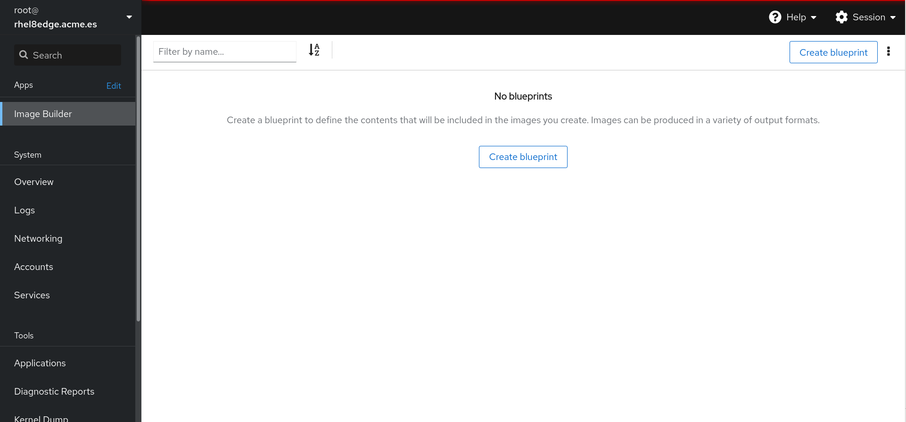
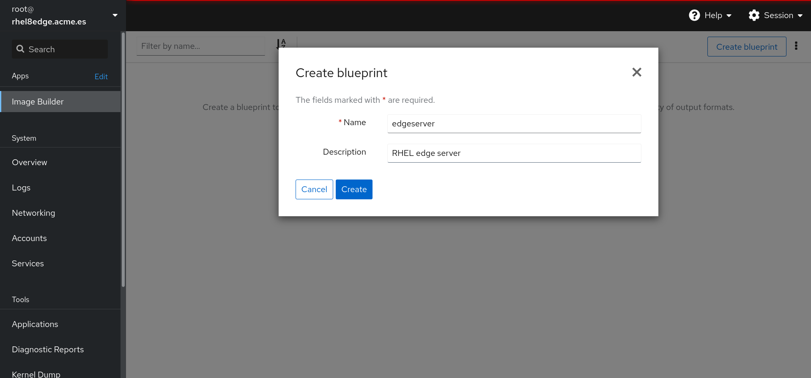
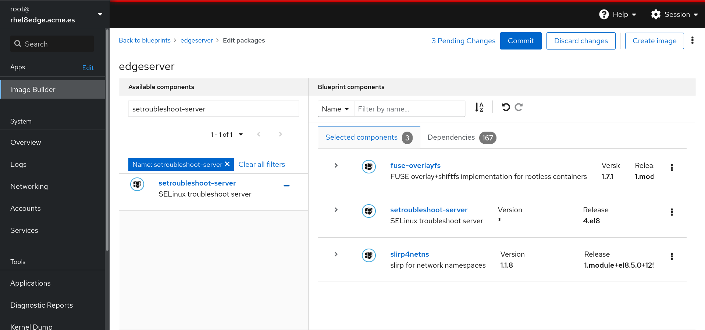
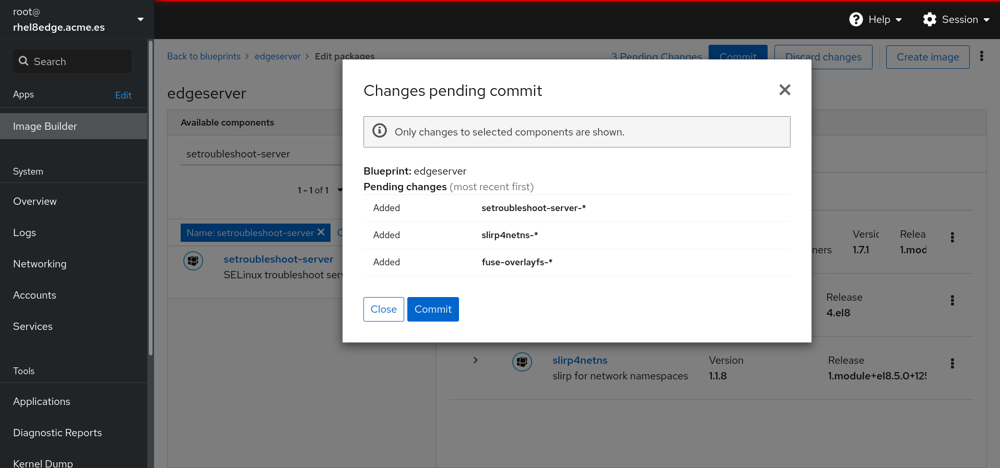
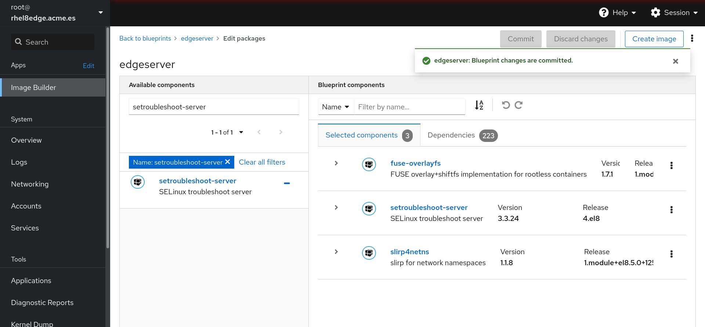
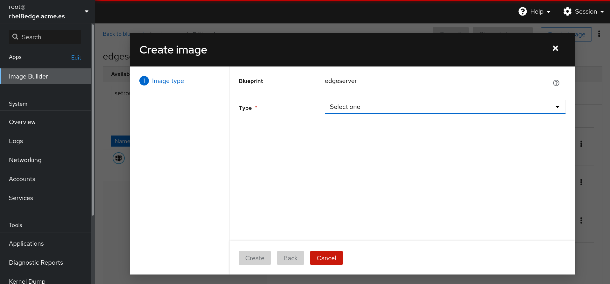
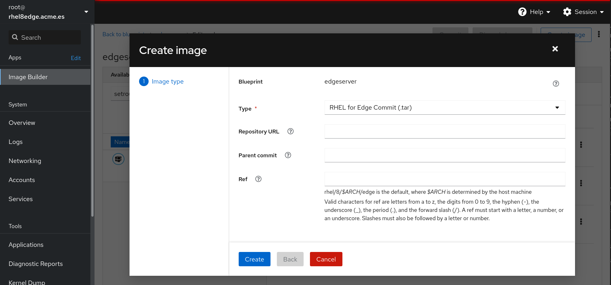
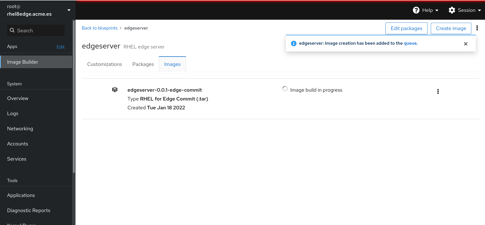

# Create edge image

Log into your server at 9090 port using the root credentials, go to **Image Builder** and create a new blueprint:

Put a name and a description:

Search for the following packages and add them:

* **fuse-overlayfs**
* **setroubleshoot-server**
* **slirp4netns**

To save the image modifications push the **Commit** button:

The image has been saved:

We have the blueprint for the image, now we can create the image to be deployed in several enviroments.

Clicking in **Create image** we will start to create the image:

In the **Type** section we can select the type of the image we want to create, select **RHEL for Edge Commit (.tar)**:

The image will start to create when pushing the **Create** button. We can check the state of the image creation in **Blueprints -> edgeserver -> Images**:

It will take several minutes to create the image.

