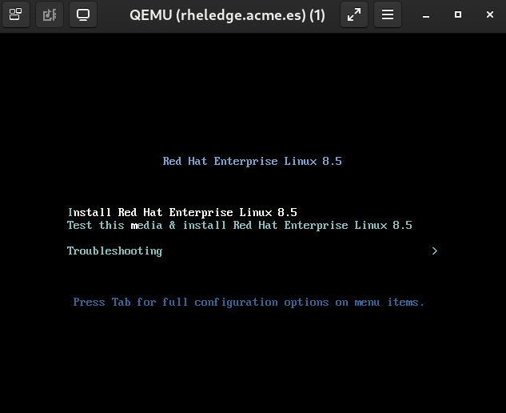

# Deploying RHEL for Edge

Once we have the hypervisor configured, the RHEL for Edge image and the boot iso we are going to deploy a Virtual Machine using the RHEL for Edge image we have created.

```console
```

This playbook will deploy a virtual machine using the RHEL for Edge image we have created.

>  If you get the following error **xorriso : FAILURE : Image size XXXXXXXXs exceeds free space on media YYYYYYYYs** check the free space in the **/tmp** filesystem. You will need to have at least twice of the RHEL 8 iso size free.

>  If we want to speed up the deployment we can connect to the virtual machine console and select the **Install Red Hat Enterprise Linux 8.5**. If not before deploying the server the iso will be checked and this will take more time.
>
> 

>  Once the deployment has finished you can use ssh to connect to the RHEL for Edge server using the ip you configured and the user **core** with password **edge**.

>  The boot iso we created can only be used to deploy one server due to network configuration is hardcoded inside the kickstart for the shake of simplicity. DHCP configuration and/or cloud-init could be used to create an iso which could be used to deploy several servers (but this is not the purpose of this workshop).