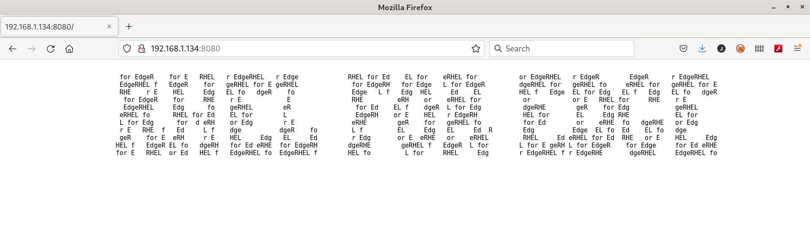

# Deploying a serverless application

An Operating System with no application is useless.

## Checking the RHEL for Edge server

When we deployed the RHEL for Edge we also deployed a containerized web application. This application is published in a non-secure registry in the RHEL 8 Server. If you connect to that server:

```console
[root@rhel8edge ~]# podman images
REPOSITORY                           TAG         IMAGE ID      CREATED       SIZE
192.168.1.222:5000/httpd             v2          0a12c9ecd326  28 hours ago  423 MB
192.168.1.222:5000/httpd             v1          78bfb437998c  28 hours ago  423 MB
192.168.1.222:5000/httpd             prod        78bfb437998c  28 hours ago  423 MB
<none>                               <none>      48d8ad8b2275  28 hours ago  423 MB
registry.access.redhat.com/ubi8/ubi  latest      fca12da1dc30  5 weeks ago   235 MB
docker.io/library/registry           2           b8604a3fe854  2 months ago  26.8 MB
[root@rhel8edge ~]#
```

When we executed the playbook to configure the RHEL 8 Server all this containers were created, the registre configured and the container published.

In the kickstart used to deploy the RHEL for Edge server a serverless container was configured to run in the Edge server.

You can connect to the server using ssh:

If you installed the **net-tools** package in the RHEL for Edge image (it was left as homework) you can see what ports have services listening to:

```console
[core@rheledge ~]$ netstat -tulnp
(Not all processes could be identified, non-owned process info
 will not be shown, you would have to be root to see it all.)
Active Internet connections (only servers)
Proto Recv-Q Send-Q Local Address           Foreign Address         State       PID/Program name    
tcp        0      0 192.168.1.134:8080      0.0.0.0:*               LISTEN      961/systemd         
tcp        0      0 0.0.0.0:22              0.0.0.0:*               LISTEN      -                   
tcp6       0      0 :::22                   :::*                    LISTEN      -                   
udp        0      0 127.0.0.1:323           0.0.0.0:*                           -                   
udp6       0      0 ::1:323                 :::*                                -     
[core@rheledge ~]$
```

The container has been deployed as serverless, this means that the container is not started and will be started when someone request the service.

But if we check what containers are running:

 ```console
[core@rheledge ~]$ podman container list
CONTAINER ID  IMAGE       COMMAND     CREATED     STATUS      PORTS       NAMES
[core@rheledge ~]$ 
```

So if we use a browser to browse the RHEL for Edge at 8080 port:



If we check the containers that are running now we can see that there is one container running:

```console
[core@rheledge ~]$ podman container list
CONTAINER ID  IMAGE                          COMMAND               CREATED         STATUS             PORTS                   NAMES
1f4cc91a333f  192.168.1.222:5000/httpd:prod  /usr/sbin/httpd -...  4 minutes ago  Up 4 minutes ago  127.0.0.1:8080->80/tcp  httpd       
[core@rheledge ~]$ 
```

If we check the ports we can see that the container is binded to **localhost:8080**:

```console
[core@rheledge ~]$ netstat -tulnp
(Not all processes could be identified, non-owned process info
 will not be shown, you would have to be root to see it all.)
Active Internet connections (only servers)
Proto Recv-Q Send-Q Local Address           Foreign Address         State       PID/Program name    
tcp        0      0 127.0.0.1:8080          0.0.0.0:*               LISTEN      1799/containers-roo 
tcp        0      0 192.168.1.134:8080      0.0.0.0:*               LISTEN      961/systemd         
tcp        0      0 0.0.0.0:22              0.0.0.0:*               LISTEN      -                   
tcp6       0      0 :::22                   :::*                    LISTEN      -                   
udp        0      0 127.0.0.1:323           0.0.0.0:*                           -                   
udp6       0      0 ::1:323                 :::*                                -                   
[core@rheledge ~]$ 
```

>  This container is not only serverless is also rootless which means that is not a privileged container. For that reason is executed as the **core** user which is not a privileged user and can not bind services in ports lower than 1024 so that's the reason to use the **8080** port.

Several systemd units were defined for the **core** user:

* **/var/home/core/.config/systemd/user/pre-pull-container-image.service** this systemd unit downloads the container image (192.168.1.222:5000/httpd:prod) from the unsecured registry at RHEL 8 Server.
* **/var/home/core/.config/systemd/user/container-httpd-proxy.socket** this systemd unit opens a socket in RHEL for Edge server at port **8080**. This will be used to access the containerized application with a bit more configuration.
* **/var/home/core/.config/systemd/user/container-httpd-proxy.service** this systemd unit it is used to forward the socket opened as stream in the systemd unit **container-httpd-proxy.socket** to **localhost:8080**.
  >  this systemd unit uses **systemd-socket-proxyd** which provide socket activation support for services that do not natively support socket activation. So we can use it to activate the systemd unit **container-httpd.service**.
* **/var/home/core/.config/systemd/user/container-httpd.service** this systemd unit starts the containerized image binding the **localhost:8080** to the container port 80.

Several systemd system units were defined as well:

* **/etc/systemd/system/expose-application.service** this systemd unit opens the 8080 port so the application is exposed to the outside world.
* **/etc/systemd/system/enable-linger.service** this systemd unit enables the linger functionality whichs allow the **core** user to use systemd services without being logged.

>  Once the container is started it will be running all the time. The ideal behaviour would be that after some inactivity time it would be stopped and started again when someone were requesting the web service.
>
> The systemd version included in RHEL 8.5 (239-51) does not support the `--exit-idle-time` for **systemd-socket-proxyd** command. To use this functionality systemd version 246 or higher is needed.

> Together with the above `StopWhenUnneeded=true` must be added to **container-httpd.service** to stop the container after some inactivity time.

