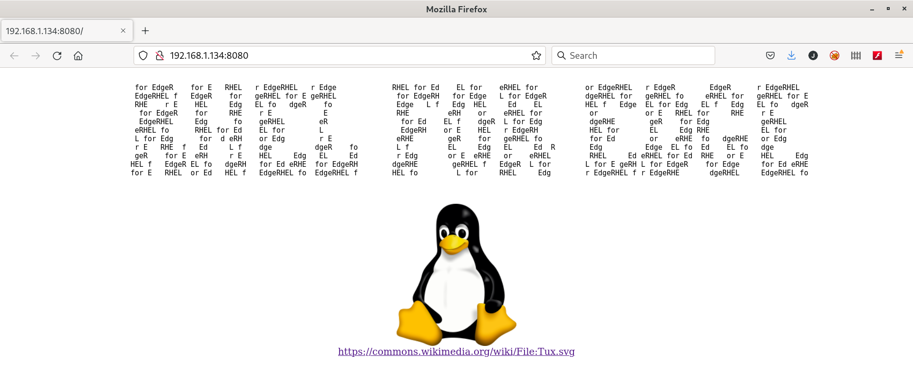

# Upgrading the application

In the RHEL 8 Server we have created two versions for the containerized application:

```console
[root@rhel8edge ~]# podman images
REPOSITORY                           TAG         IMAGE ID      CREATED       SIZE
192.168.1.222:5000/httpd             v2          55704dd882b9  18 hours ago  424 MB
192.168.1.222:5000/httpd             v1          1a4c99e635e2  18 hours ago  424 MB
192.168.1.222:5000/httpd             prod        1a4c99e635e2  18 hours ago  424 MB
registry.access.redhat.com/ubi8/ubi  latest      fca12da1dc30  5 weeks ago   235 MB
docker.io/library/registry           2           b8604a3fe854  2 months ago  26.8 MB
[root@rhel8edge ~]#
```

We can check that images tagged with **v1** and **prod** are the same image by their **IMAGE ID**. The **prod** version is the version which was included in the RHEL for Edge installation image that was deployed using the boot ISO.

Now we are going to upgrade to the **v2** version.

## How the upgrade process works

Two systemd units were defined for the **core** user:

* **/var/home/core/.config/systemd/user/podman-auto-update.timer** this is a systemd timer which periodically triggers the systemd service **podman-auto-update.service**.
* **/var/home/core/.config/systemd/user/podman-auto-update.service** this systemd unit runs **podman auto-update** which scans if there is a newer version for the application in the registry and when it detects a new version pulls it and update the container image with the newer image.

## Performing the upgrade

The `podman-auto-update.service` systemd unit is looking for new versions in the registry for **192.168.1.222:5000/httpd:prod**:

```console
[core@rheledge ~]$ podman container list
CONTAINER ID  IMAGE                          COMMAND               CREATED         STATUS             PORTS                   NAMES
1f4cc91a333f  192.168.1.222:5000/httpd:prod  /usr/sbin/httpd -...  12 minutes ago  Up 12 minutes ago  127.0.0.1:8080->80/tcp  httpd       
[core@rheledge ~]$ 
```

>  Note the **CONTAINER ID** and the **CREATED** and **STATUS** fields for the running container.

We can use the **skopeo** utility to inspect the registry which was deployed in the RHEL 8 Server:

```console
[core@rheledge ~]$ skopeo list-tags docker://192.168.1.222:5000/httpd
{
    "Repository": "192.168.1.222:5000/httpd",
    "Tags": [
        "v1",
        "prod",
        "v2"
    ]
}
[core@rheledge ~]$
```
In the registry the versions tagged as **v1** and **prod** are the same and there is a new version tagged as **v2**:

```console
[core@rheledge ~]$ skopeo inspect docker://192.168.1.222:5000/httpd:v1 | jq ".Digest"
"sha256:930e765675bd8eed76342db6b0785eebd18002bab751cff3c3fd0e349b69e805"
[core@rheledge ~]$ skopeo inspect docker://192.168.1.222:5000/httpd:prod | jq ".Digest"
"sha256:930e765675bd8eed76342db6b0785eebd18002bab751cff3c3fd0e349b69e805"
[core@rheledge ~]$ skopeo inspect docker://192.168.1.222:5000/httpd:v2 | jq ".Digest"
"sha256:5dfef88b0b47071a3caa6074a0b0e0dd4d5f4b1a842463ec6004c1a91e0aa391"
[core@rheledge ~]$ 
```

We are going to tag the **v2** version as **prod** so the `podman-auto-update.service` will detect that there is a different version for the application running in the RHEL for Edge and the application will be updated to the new one.

Although we can perform that actions in the RHEL for Edge server, we are going to perform them in the RHEL 8 Server.

First we tag the **v2** version as **prod**:

```console
[root@rhel8edge ~]# podman images
REPOSITORY                           TAG         IMAGE ID      CREATED       SIZE
192.168.1.222:5000/httpd             v2          55704dd882b9  22 hours ago  424 MB
192.168.1.222:5000/httpd             v1          1a4c99e635e2  22 hours ago  424 MB
192.168.1.222:5000/httpd             prod        1a4c99e635e2  22 hours ago  424 MB
registry.access.redhat.com/ubi8/ubi  latest      fca12da1dc30  5 weeks ago   235 MB
docker.io/library/registry           2           b8604a3fe854  2 months ago  26.8 MB
[root@rhel8edge ~]# podman tag  192.168.1.222:5000/httpd:v2 192.168.1.222:5000/httpd:prod
[root@rhel8edge ~]# podman images
REPOSITORY                           TAG         IMAGE ID      CREATED       SIZE
192.168.1.222:5000/httpd             v2          55704dd882b9  22 hours ago  424 MB
192.168.1.222:5000/httpd             prod        55704dd882b9  22 hours ago  424 MB
192.168.1.222:5000/httpd             v1          1a4c99e635e2  22 hours ago  424 MB
registry.access.redhat.com/ubi8/ubi  latest      fca12da1dc30  5 weeks ago   235 MB
docker.io/library/registry           2           b8604a3fe854  2 months ago  26.8 MB
[root@rhel8edge ~]# 
```

Now we push that changes to the registry to be available:

```console
[root@rhel8edge ~]# podman push --tls-verify=false 192.168.1.222:5000/httpd:prod
Getting image source signatures
Copying blob 3ba8c926eef9 skipped: already exists  
Copying blob b74d9c818c9f skipped: already exists  
Copying blob 70c66579b9cc skipped: already exists  
Copying blob 352ba846236b [--------------------------------------] 0.0b / 0.0b
Copying config 55704dd882 [======================================] 2.4KiB / 2.4KiB
Writing manifest to image destination
Storing signatures
[root@rhel8edge ~]# 
```

If we check the running containers in the RHEL for Edge we can see that there is a new container running:

```console
[core@rheledge ~]$ podman container list
CONTAINER ID  IMAGE                          COMMAND               CREATED         STATUS             PORTS                   NAMES
35668bc8ab37  192.168.1.222:5000/httpd:prod  /usr/sbin/httpd -...  22 seconds ago  Up 22 seconds ago  127.0.0.1:8080->80/tcp  httpd
[core@rheledge ~]$
```

>  Compare the **CONTAINER ID**, **CREATED** and **STATUS** fields with the ones in the previous container.

Now if we browse the application we can see the new version:


